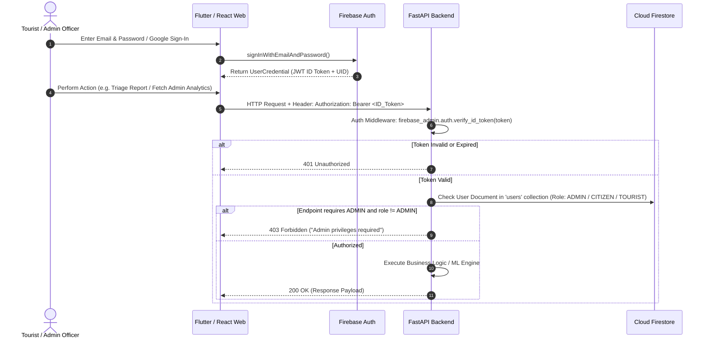
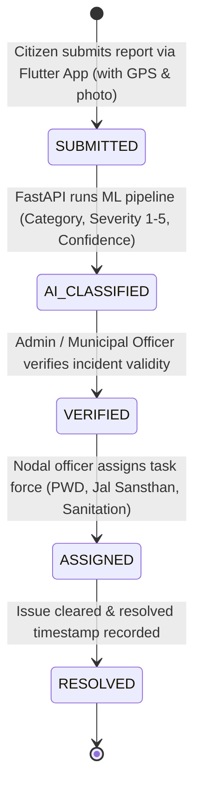

# PahadiPulse: Final Frozen Engineering Architecture Specification

**Project:** PahadiPulse (पहाड़ी पल्स) — Regional Tourism & Community Intelligence Platform for Uttarakhand  
**Problem Statement:** IBM Hackathon PS-04 — "Solve for My Region"  
**Focus:** Regional Tourism Pressure + Local Infrastructure Strain + Community Livelihood Distribution  
**Document Status:** FROZEN & FINALIZED (Pre-Implementation Architectural Baseline)

---

## 1. System Architecture & Topology

```
                                  ┌──────────────────────────────────────────────────────────┐
                                  │                  Firebase Cloud Services                 │
                                  ├────────────────────────────┬─────────────────────────────┤
                                  │ • Firebase Authentication  │ • Firebase Storage (Images) │
                                  │   (ID Tokens / JWT)        │   (Issue Proof Photos)      │
                                  └────────────────────────────┴─────────────────────────────┘
                                                ▲                               ▲
                                                │ (1) Direct Auth               │ (2) Direct Upload
                                                │                               │
                ┌───────────────────────────────┴───────────────────────────────┴───────────────────────────────┐
                │                                                                                               │
     ┌───────────────────────┐                                                                       ┌───────────────────────┐
     │  Flutter Mobile App   │                                                                       │ React + Vite Web App  │
     │  (Tourist / Citizen)  │                                                                       │ (Admin & Municipal)   │
     │  • flutter_map (OSM)  │                                                                       │ • Leaflet + OSM       │
     └──────────┬────────────┘                                                                       └──────────┬────────────┘
                │                                                                                               │
                │ (3) HTTPS / REST (Bearer ID Token)                                                            │ (3) HTTPS / REST (Bearer ID Token)
                │                                                                                               │
                └───────────────────────────────────────┬───────────────────────────────────────────────────────┘
                                                        ▼
                                      ┌───────────────────────────────────┐
                                      │       FastAPI Python Backend      │
                                      │ • Auth Middleware (Token Decode)  │
                                      │ • Role-Based Access Control       │
                                      │ • Pressure Calculation Engine     │
                                      │ • Validation & Sanitization Layer │
                                      └─────────────────┬─────────────────┘
                                                        │
                               ┌────────────────────────┴────────────────────────┐
                               ▼                                                 ▼
                ┌──────────────────────────────┐                  ┌──────────────────────────────┐
                │   Cloud Firestore Database   │                  │   Embedded Python ML Layer   │
                │ • destinations               │                  │ • 7-Day Pressure Forecaster  │
                │ • reports                    │                  │ • NLP Category Classifier    │
                │ • local_providers            │                  │ • AI Severity Scorer (1-5)   │
                │ • pressure_history           │                  │ • Multi-Objective Optimizer  │
                │ • itineraries                │                  └──────────────────────────────┘
                │ • users                      │
                └──────────────────────────────┘
```

---

## 2. Direct Firebase vs Backend API Boundaries

To avoid ambiguity, network bottlenecks, or security loopholes, the exact access boundaries are defined as follows:

| Functionality | Direct Client $\rightarrow$ Firebase | Client $\rightarrow$ FastAPI $\rightarrow$ Firebase / ML | Rationale |
|---|---|---|---|
| **User Sign-Up & Login** | ✅ **Direct Firebase Auth** | ❌ None | Clients authenticate directly against Firebase SDK to obtain secure JWT ID Tokens. Zero password handling on backend. |
| **Image / Proof Uploads** | ✅ **Direct Firebase Storage** | ❌ None | Large binary uploads (citizen issue photos) go directly to Firebase Storage bucket using client SDK; client passes resulting download URL to FastAPI. |
| **All Business Queries & Reads** | ❌ No direct Firestore reads | ✅ **FastAPI** (`GET /api/*`) | Centralizes caching, sub-score breakdown calculations, and data normalization. |
| **Citizen Issue Reporting** | ❌ No direct Firestore writes | ✅ **FastAPI** (`POST /api/reports`) | Every report must trigger synchronous AI NLP classification, severity scoring, and geo-sanitization before saving. |
| **Pressure Score & Forecasting** | ❌ No direct calculation | ✅ **FastAPI** (`GET /api/destinations/...`) | ML inference and 5-factor deterministic formulas run strictly inside the backend engine. |
| **Itinerary Generation** | ❌ None | ✅ **FastAPI** (`POST /api/itineraries/generate`) | Requires heuristic multi-objective optimization solver and pressure-penalty algorithms. |
| **Admin Triage & Status Updates** | ❌ No direct updates | ✅ **FastAPI** (`PATCH /api/reports/...`) | Enforces role verification (`ADMIN` / `OFFICER`) before modifying official state machines. |

---

## 3. Communication Protocols

### A. Flutter Mobile $\rightarrow$ FastAPI
- **Transport**: HTTPS / REST via `http` / `dio` package.
- **Base URL**:
  - Android Emulator: `http://10.0.2.2:8000/api`
  - Real Device / Production: Configured via environment build flag `API_BASE_URL`.
- **Headers**:
  - `Authorization: Bearer <Firebase_ID_Token>`
  - `Content-Type: application/json`

### B. React Admin Dashboard $\rightarrow$ FastAPI
- **Transport**: HTTPS / REST via Axios instance with automatic request interceptors.
- **Base URL**: `http://localhost:8000/api` (or environment variable `VITE_API_BASE_URL`).
- **Headers**:
  - `Authorization: Bearer <Firebase_ID_Token>`
  - `Content-Type: application/json`

---

## 4. Authentication, Authorization & Role Protection Flow



### Role Hierarchy:
1. `TOURIST`: Read destinations, view pressure scores, generate itineraries, view local providers, create demo user account.
2. `CITIZEN`: All `TOURIST` capabilities + submit geo-tagged issue reports and track personal report status.
3. `ADMIN` / `OFFICER`: Full access to update destination carrying capacities, triage citizen reports (`VERIFIED`, `ASSIGNED`, `RESOLVED`), verify local providers, and view district-wide analytics.

---

## 5. Regional Pressure Score Calculation Engine

### The 5-Factor Weighted Formula
Every destination's pressure score $P \in [0, 100]$ is computed deterministically:

$$P = (0.30 \times S_{\text{tourism}}) + (0.25 \times S_{\text{water}}) + (0.20 \times S_{\text{waste}}) + (0.15 \times S_{\text{traffic}}) + (0.10 \times S_{\text{env}})$$

Where each sub-score $S_i \in [0, 100]$ is defined as:
1. **$S_{\text{tourism}}$ (30%)**: Ratio of current estimated visitors to daily carrying capacity:
   $$S_{\text{tourism}} = \min\left(100, \frac{\text{Current Visitors}}{\text{Daily Carrying Capacity}} \times 100\right)$$
2. **$S_{\text{water}}$ (25%)**: Water resource stress index (municipal supply deficit, tanker demand, groundwater stress).
3. **$S_{\text{waste}}$ (20%)**: Solid waste accumulation index (generation rate vs daily municipal clearance efficiency).
4. **$S_{\text{traffic}}$ (15%)**: Transit corridor congestion index (ghat bottleneck delays, parking availability ratio).
5. **$S_{\text{env}}$ (10%)**: Seasonal hazard index (slope instability, active rainfall/landslide risk alert).

### Standardized Pressure Status Tiers:
- **0 – 30**: 🟢 `LOW` (Optimal carrying capacity; prime for tourist diversion).
- **31 – 50**: 🟡 `MODERATE` (Healthy regional load).
- **51 – 70**: 🟠 `HIGH` (Resource pinch detected; early warning issued).
- **71 – 100**: 🔴 `CRITICAL` (Carrying capacity exceeded; active diversion enforced in trip planner).

*Rule: The backend dynamically computes and returns the natural language explanation and sub-score breakdown for every destination.*

---

## 6. Machine Learning Pipeline Architecture

```
                    ┌─────────────────────────────────────────────────────────┐
                    │               Embedded Scikit-Learn Engines             │
                    └─────────────────────────────────────────────────────────┘
                                  │                             │
                 ┌────────────────┴──────────────┐              │
                 ▼                               ▼              ▼
     ┌───────────────────────┐       ┌───────────────────────┐ ┌───────────────────────────┐
     │  Pressure Forecaster  │       │ AI Report Classifier  │ │ Multi-Objective Optimizer │
     │  • Model: RF / GBDT   │       │ • TF-IDF + Calibrated │ │ • Constrained Pareto      │
     │  • Output: 7-Day Trend│       │ • Outputs: Category & │ │ • Pressure Penalty +      │
     │    with bounds [L, U] │       │   Severity (1 to 5)   │ │   Local Economic Spread   │
     └───────────────────────┘       └───────────────────────┘ └───────────────────────────┘
```

### A. 7-Day Pressure Trend Forecaster
- **Input Vector**:
  $$\vec{x} = [P_{\text{current}}, \text{DayOfWeek}, \text{IsWeekendFlag}, \text{HolidayFlag}, \text{RainfallIndex}, \text{ActiveReportsCount}, \text{HotelOccupancyEst}]$$
- **Model**: `RandomForestRegressor` (pre-trained & serialized via `joblib`).
- **Output**: 7 daily predictions $[t+1, \dots, t+7]$ with 95% confidence intervals $[P_{\text{lower}}, P_{\text{upper}}]$ and primary risk factors (e.g., "Weekend surge + water deficit").

### B. Citizen Report NLP Category & Severity Classifier
- **Preprocessing**: Mountain terminology normalization (*chakka jam*, *gadhera*, *malba*, *khal*).
- **Pipeline**: `TfidfVectorizer(ngram_range=(1, 2), sublinear_tf=True)` $\rightarrow$ `LogisticRegression(class_weight='balanced')`.
- **Multi-Output Inferences**:
  1. **Category**: `WATER`, `WASTE`, `ROAD`, `TRAFFIC`, `HEALTH`, `CONNECTIVITY`, `TOURISM`, `ENVIRONMENT`, `OTHER`.
  2. **Severity (1 to 5)**: Evaluates structural danger and urgency.
  3. **Confidence Score**: $C \in [0.00, 1.00]$.
  4. **Action Recommendation**: Standardized SOP dispatch instruction.

### C. Smart Itinerary Optimization Flow
$$\text{Maximize } \sum_{d \in \text{Route}} \left( w_1 \cdot \text{InterestMatch}(d) + w_2 \cdot \text{BudgetFit}(d) + w_3 \cdot \text{ProviderBenefit}(d) - w_4 \cdot (P(d))^2 \right) - \text{BacktrackPenalty}$$
- **Constraint**: Strict penalty against destinations where $P(d) > 70$ (e.g. Mussoorie/Nainital) when nearby low-pressure alternatives (e.g. Kanatal, Chopta, Chakrata) fit the user's budget and interests.
- **Output**: Multi-day itinerary, stay recommendations at verified homestays, and calculated **Pressure Mitigation Score** (e.g., *"-64% regional strain avoided"*).

---

## 7. Citizen Report Processing & Triage Flow



---

## 8. Database Schema & Collections (Cloud Firestore)

```
Firestore Root
├── destinations/           {id, name, district, lat, lng, capacity, currentVisitors, scores, status, tags, isDemo}
├── reports/                {id, userId, destId, category, desc, imageUrl, lat, lng, aiCategory, aiSeverity, status, isDemo}
├── pressure_history/       {id, destId, date, scores, pressureScore, incidentCount}
├── pressure_predictions/   {id, destId, forecastDate, predictedPressure, bounds, riskFactor}
├── local_providers/        {id, destId, name, category, desc, contact, price, verified, rating, isDemo}
├── itineraries/            {id, userId, daysCount, budget, interests, mitigationScore, days, createdAt}
└── users/                  {uid, email, displayName, role: 'TOURIST'|'CITIZEN'|'ADMIN'}
```

---

## 9. Separation of Demo / Synthetic vs User-Generated Data

To strictly comply with the rule against fabricating claims of live real-time telemetry while providing a rich hackathon demonstration:
1. **Explicit Data Labeling**:
   - Every seeded destination, historical log, and demo provider includes a boolean field:
     `"isDemo": true` or `"dataSource": "DEMO_SYNTHETIC_HACKATHON"`.
2. **User-Created Isolation**:
   - Live citizen reports submitted during evaluation are tagged `"isDemo": false` and persist in Firestore under live incident logs.
3. **Admin Indicator**:
   - The Admin dashboard and Mobile app explicitly display a `"⚡ Hackathon Demo Mode Active"` badge when showcasing predictive models.

---

## 10. Hackathon Architectural Simplifications (Pruning Over-Engineering)

To ensure high reliability, rapid execution, and zero unnecessary points of failure during judging:

| ❌ Pruned / Rejected (Over-Engineered) | ✅ Adopted Frozen Design (Reliable & Lean) |
|---|---|
| Heavy Microservices (Kubernetes, gRPC, Kafka) | **Single High-Performance FastAPI Backend** with clean modular routers. |
| Complex Distributed Heavy LLMs / GPUs | **Lightweight, instant Scikit-Learn NLP & Regression models** embedded directly in Python runtime (< 10ms inference). |
| Full Payment Gateways / Booking Engine | **Direct Provider Contacts & Verified Booking Links** (Focused strictly on PS-04 livelihood distribution). |
| Real-time WebSockets with Redis cluster | **Fast REST APIs with 30s polling / Firestore real-time client listeners**. |
| Complex Multi-Tenant Cloud Infra | **Clean Dockerized Backend + Vercel Static Web Build + Local / Cloud dual-mode**. |

---

## 11. Complete Module & Screen Matrix

### Mobile Screens (Flutter):
1. `Splash & Onboarding` (Mountain branding, problem statement overview)
2. `Authentication` (Login / Register / Guest Demo Mode)
3. `Tourist Home` (**Prioritizing "PLAN MY TRIP"**, Explore, Report Issue, Local Experiences)
4. `Explore Destinations` (Search, district filter, status badges)
5. `Destination Detail` (Sub-score breakdown, carrying capacity, spots)
6. `Regional Pressure Map` (`flutter_map` with interactive pressure pins)
7. `AI Trip Planner Wizard` (Duration, travelers, budget, interests)
8. `Generated Itinerary Detail` (Day-by-day plan, mitigation score, homestays)
9. `Local Experiences Directory` (Homestays, guides, Pahadi food, handicrafts)
10. `Citizen Issue Reporter` (GPS, description, category selector, instant AI feedback)
11. `My Reports Tracking` (Status tracker from `SUBMITTED` to `RESOLVED`)

### Admin Dashboard Screens (React + Vite):
1. `Admin Login` (Firebase Auth / Quick Officer Access)
2. `Overview Dashboard` (KPI stats, critical issue alerts, high-pressure hotspots)
3. `Regional Spatial Map` (Leaflet with pressure radius circles & layer controls)
4. `Destinations Management` (Capacity editor, real-time load ratios)
5. `Pressure Analytics & ML Forecasting` (7-day trend chart with confidence bands)
6. `Citizen Reports & AI Triage` (Workflow state machine: Verify $\rightarrow$ Assign $\rightarrow$ Resolve)
7. `Local Providers Management` (Homestay & Guide verification system)
8. `District Intelligence & Analytics` (District-wise charts & category donuts)
9. `AI Simulator Workbench` (Interactive testing bench for judges)

---

## 12. Architecture Sign-Off & Status

This architecture document is **frozen and approved**. It satisfies all constraints of IBM Hackathon PS-04, provides clear data flows, defines strict boundaries for Firebase and FastAPI, eliminates over-engineering, and is ready for structured execution.
